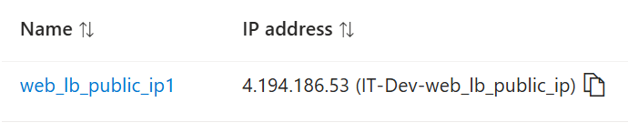
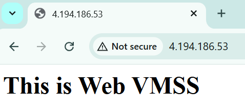
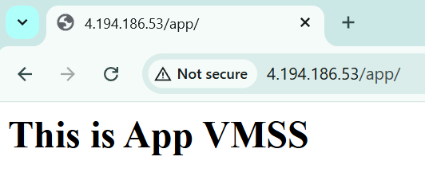
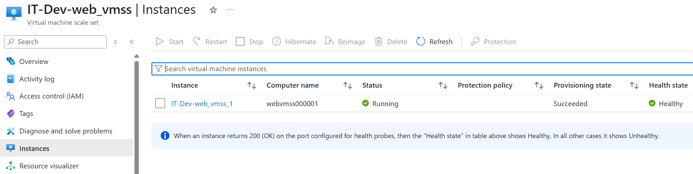
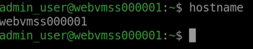
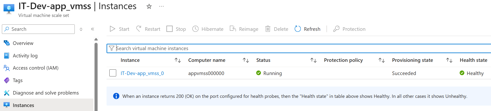
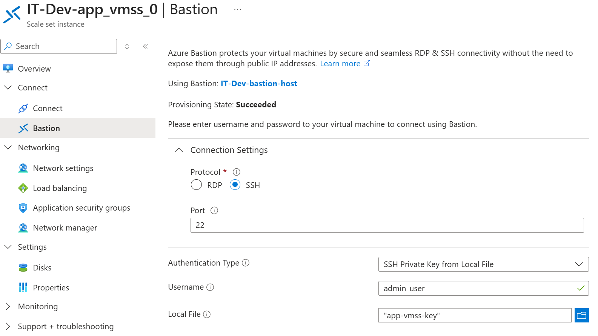
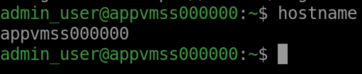
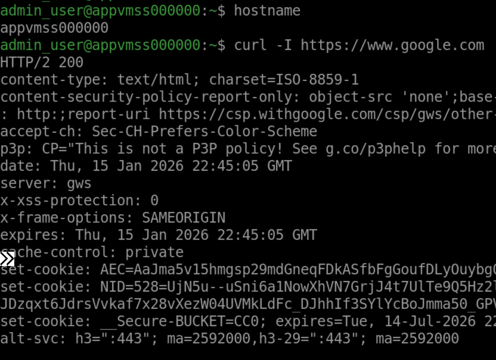

  
   
  <em>Network Architecture & Traffic Flow</em>

## Overview

Above is a **hub–spoke** Azure network design: **VNet-Hub** hosts the public entry point and admin access, while **VNet-Spoke** hosts the private app tier. The VNets are connected via **VNet Peering** so the web tier can privately reach the app tier. Internet traffic comes in through a **Public Load Balancer** to **Web-VMSS**, which acts as a **reverse proxy** for `/app/*` to an **Internal Load Balancer** in the spoke that fronts **App-VMSS**. Web-VMSS pulls its reverse-proxy `.conf` file from a **private Blob container** using a **Managed Identity** (granted Storage Blob Data Reader role). Admin access uses **Azure Bastion**. The app subnet uses a **NAT Gateway** for internet access from private instances.

---

## Details

* **VNet Peering**

  * Connects **VNet-Hub** ↔ **VNet-Spoke**
  * Rationale: To enable private traffic flow between web and app while preserving service segmentation

---
* **Public Load Balancer**

    * **Frontend**

      * Public IP
    * **Backend pool**

      * **Web-VMSS** instances
    * **Health probe**

      * checks TCP 80
      
    * **Load Balancing Rule**

      * Protocol: TCP
      * Frontend Port: 80
      * Backend Port: 80
    
    * Rationale: To improve availability by spreading traffic only to healthy instances, and to enhance security by reducing direct exposure of backend VMs

* **VNet-Hub**

  * **Subnet: AzureBastionSubnet**

    * **Azure Bastion**

      * **Public IP** attached
      * Rationale: To secure admin access (SSH/RDP) to private VMs/VMSS instances
    

  * **Subnet: Web-Subnet**

    * **Web-VMSS (RHEL)**

      * Receives user traffic from **Public Load Balancer**
      * Reverse proxies `/app/*` to the app tier
      * **Autoscaling**

        * Default profile (CPU-based)
      * **Rolling upgrade enabled**
        * Rationale: To ensure higher availability by updating VMs only one batch at a time

      * **Managed Identity**
        * System-assigned
        * Used to access the private Blob container
        * Granted with Storage Blob Data Reader role
        * Rationale: No burden of secret storage and rotation + lower risk of credential leakage
      * **Configuration**

        * Downloads reverse-proxy `.conf` from a private blob container
    * **Network Security Group**

      * Inbound rules:

        * Allow all inbound HTTP traffic to Port 80
        * Rationale: Load Balancer preserves the original client IP address and doesn't perform SNAT
      * Outbound rules:

        * Default

  * **Storage Account**

    * Private Blob container

      * Stores the reverse-proxy `.conf` file used by Web-VMSS

---

* **VNet-Spoke**

  * **Subnet: App-Subnet**

    * **Internal Load Balancer**

      * **Frontend**

        * Static private IP inside App-Subnet
      * **Backend pool**

        * **App-VMSS** instances

      * **Health probe**

        * checks TCP 80
      * **Load Balancing Rule**

        * Protocol: TCP
        * Frontend Port: 80
        * Backend Port: 80
      * Rationale: Better Security + Improved Availability
   
    * **Network Security Group**

      * Inbound rules:

        * Default
        * Rationale: Default inbound rules already allow Load Balancer and VNet traffic (which includes peered VNets)
      * Outbound rules:

        * Default

    * **App-VMSS (RHEL)**

      * **Autoscaling**

        * Recurrence profile
      * **Rolling upgrade enabled**

    * **NAT Gateway**

      * Static Public IP
      * Rationale: When VM/VMSS is placed behind an Internal LB, their default outbound access to the public internet will be auto-removed. (Note that default outbound access to internet will be retired by Azure soon)
      

---

## Traffic flows

* **Inbound (internet users)**

  * Internet → **Public Load Balancer** → **Web-VMSS**

* **Private traffic (/app/ requests)**

  * **Web-VMSS** → (reverse proxy) → (VNet Peering) → **Internal Load Balancer** → **App-VMSS**

* **Admin access**

  * Admin user → **Azure Bastion** → private IP SSH/RDP → VMSS instances

* **Outbound (app tier)**

  * **App-VMSS** → **NAT Gateway** → Internet

---

## Outcomes
1. **Public entry allowed to Web VMSS through Public Load Balancer's public ip**
2. **Web VMSS can download reverse-proxy `.conf` file from Storage Account using Managed Identity**
3. **Reverse proxy to App VMSS for /app/ requests via Internal Load Balancer** 
4. **Hub and Spoke can communicate via Peering**
5. **Admin access to Web and App VMSS through Bastion**
6. **Outbound access to internet enabled for App VMSS through NAT Gateway**

---
## Tests

  
   
  <em>Public IP address of Public Load Balancer</em>

  
   
  <em>Internet users can reach Web VMSS</em>

  
   
  <em>Internet users can reach App VMSS via Web VMSS's reverse proxy when requesting for /app/*</em>

  
   
  <em>Web VMSS shown as 'Healthy'</em>

  
   
  <em>Connecting to Web VMSS via Bastion</em>

  
   
  <em>Logged in to Web VMSS successfully</em>

  
   
  <em>App VMSS shown as 'Healthy'</em>

  
   
  <em>Connecting to App VMSS via Bastion</em>

  
   
  <em>Logged in to App VMSS successfully</em>

  
   
  <em>App VMSS granted outbound access to internet</em>

**All tests passed successfully✅**

---
## Updates

* **(Jan 27, 2026) GitHub Actions added:**

  terraform fmt + validate, TFLint, and Checkov run on every PR and push to main

